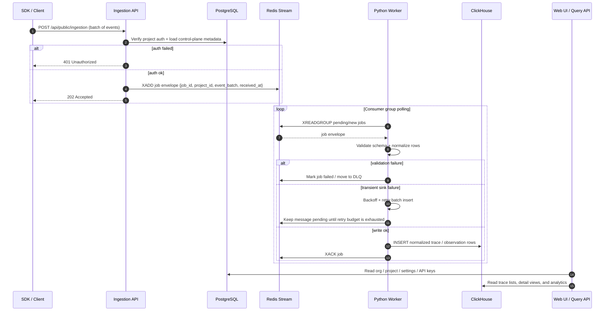

# Mini-Langfuse Roadmap v3

> This roadmap is the working plan for the next product steps after the core observability / prompt / eval loop.
> It is intentionally split into five phases so we can ship value incrementally without waiting for a big-bang rewrite.

## Phase 1 - Settings, profile, and theme

Goal: give every signed-in user a real settings area.

Scope:
- Settings home and section navigation
- Profile editing: display name and email
- Password change
- Session management: view and revoke browser sessions
- Theme switcher: light, dark, and system

Why now:
- The app already has auth, orgs, projects, and API keys.
- A settings surface makes the product feel complete and is the natural next step after login.
- Theme preference is a low-risk quality-of-life upgrade that helps the app feel like a real SaaS.

## Phase 2 - Project context everywhere

Goal: make the active project the single source of truth across the full UI.

Scope:
- Replace remaining demo-key-only client calls
- Ensure traces, sessions, prompts, dashboards, scores, datasets, and evals all respect the selected project
- Add shared project-scoped API helpers
- Make project switches refresh all visible data

Why next:
- Multi-tenancy is only real when every page is scoped correctly.
- This removes the last major split between authenticated UI state and data access.

## Phase 3 - Organization and member management

Goal: match Langfuse-style RBAC workflows.

Scope:
- Create and rename organizations
- Create, rename, delete, and transfer projects
- Invite members by email
- Change org/project roles
- Show role-based access in settings

Why next:
- Langfuse’s multi-tenant model is organization-first, not just project-first.
- This is the step that turns the app from “single-user with login” into “team software”.

## Phase 4 - Project-level defaults and branding

Goal: make self-hosting and project setup feel polished.

Scope:
- LLM connection defaults for playground and evals
- Project-level model/provider settings
- UI branding links and logo customization
- Module visibility controls
- Headless initialization for default org/project/key bootstrap

Why next:
- This is where the app starts feeling configurable enough for real deployments.
- It also reduces manual setup work for new installs.

## Phase 5 - Governance and enterprise readiness

Goal: finish the operational and compliance layer.

Scope:
- Data deletion and retention policies
- Audit logs
- Account deletion flows
- SSO / OIDC
- SCIM and automated provisioning
- Multi-instance streaming infrastructure

Why last:
- These features matter a lot in production, but they depend on the core product model already being stable.
- They are higher coordination work and should come after the user-facing settings and project model are solid.

## Execution Order

Recommended implementation order:
1. Phase 1
2. Phase 2
3. Phase 3
4. Phase 4
5. Phase 5

Current status:
- Phase 1 is in progress.
- Phase 2+ are planned and should stay behind the current work until Phase 1 is merged.

## Data Plane Rollout Order

This is the implementation order for the Redis -> worker -> ClickHouse path. It is intentionally separate from the product phases above so we can migrate tracing storage without blocking the settings and profile work.

1. Define the ingestion job contract
   - Add an internal queue envelope with `job_id`, `project_id`, `event_batch`, `attempt`, and `received_at`.
   - Make every event carry a stable `event_id` for idempotency.
   - Keep the current request/response shape unchanged for SDKs.
2. Add the worker as a shadow consumer
   - Let the API enqueue jobs into Redis after auth and validation.
   - Keep the existing PostgreSQL write path active for a short overlap window.
   - Use the worker to normalize payloads and write to ClickHouse in parallel for verification.
3. Move read traffic for traces and observations to ClickHouse
   - Point list/detail/analytics endpoints at ClickHouse for all trace data.
   - Keep PostgreSQL for control-plane data only: users, orgs, projects, API keys, settings, prompts, datasets, and eval metadata.
4. Switch ingestion to queue-first persistence
   - Return `202 Accepted` once the job is durably queued.
   - Treat worker retries and dead-letter handling as the source of truth for write durability.
   - Stop synchronously persisting trace/observation rows in PostgreSQL.
5. Add operational hardening
   - Batch sizing, retry backoff, and dead-letter queue inspection.
   - Queue lag metrics, worker health checks, and ClickHouse insert visibility.
   - Optional raw event archive for recovery and reprocessing.

## Detailed Ingestion Flow

